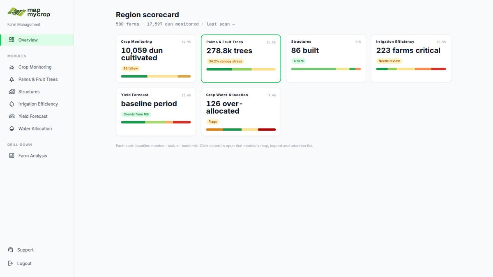
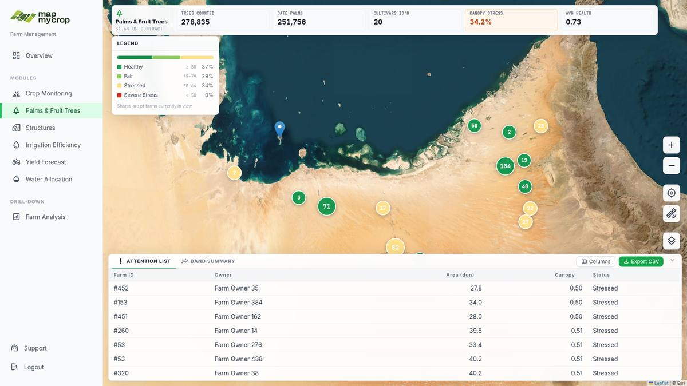
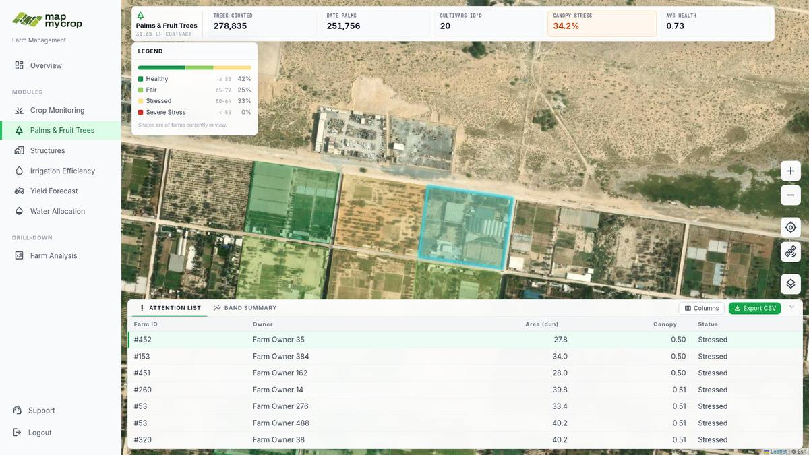
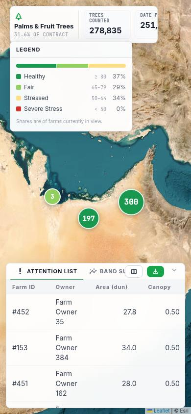
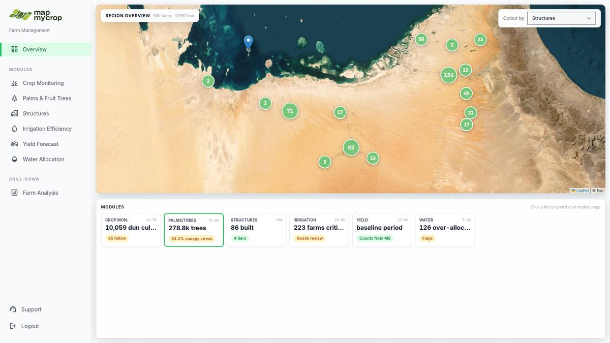
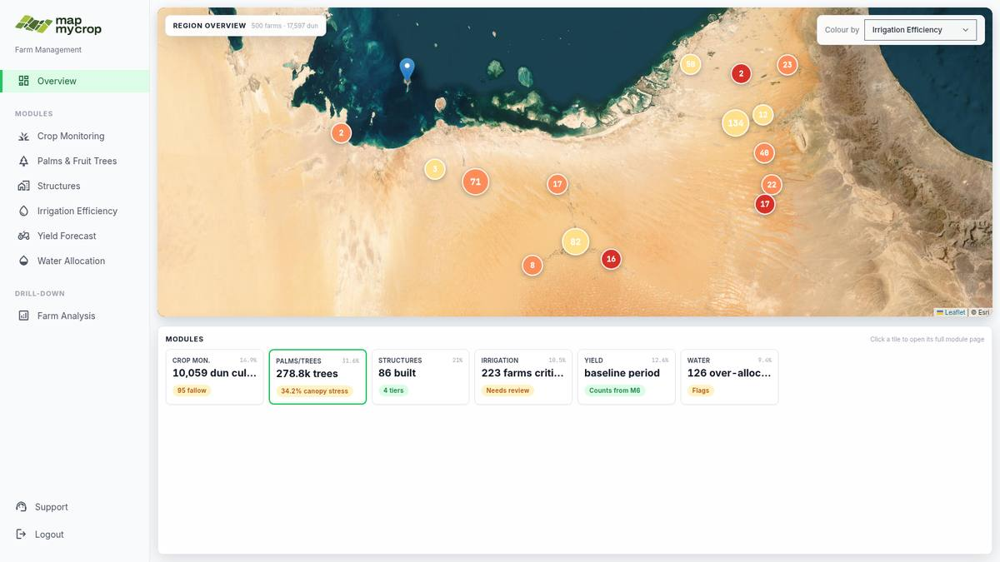
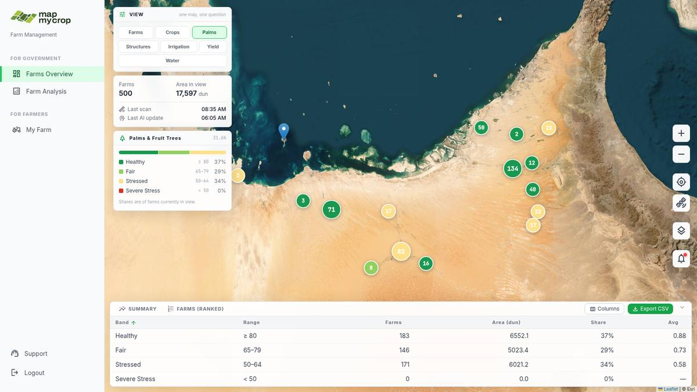
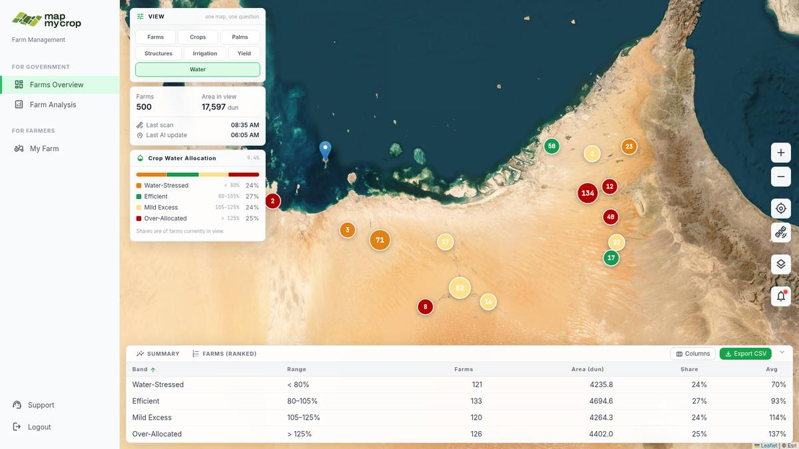
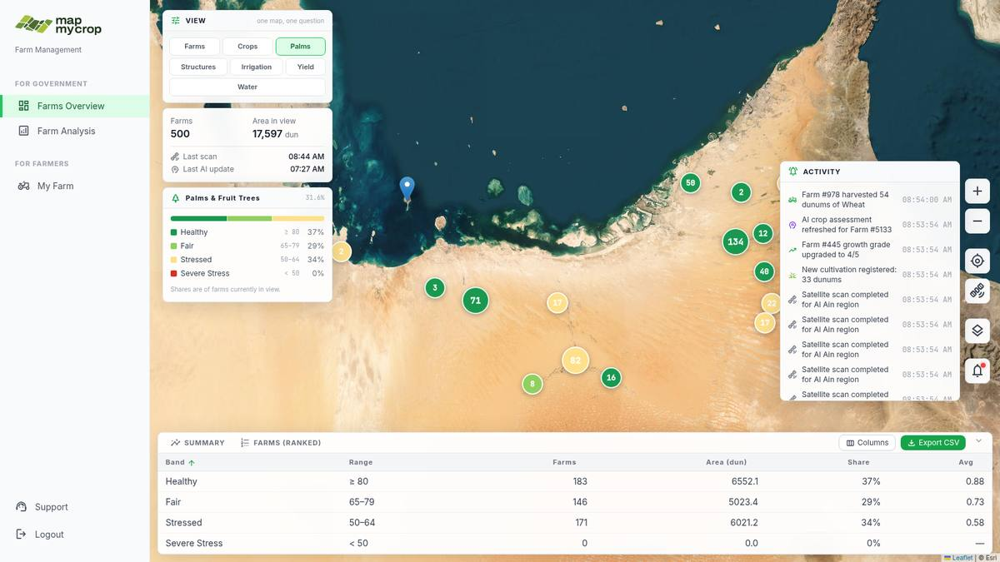

# UX/UI review — the three layout proposal branches

**Scope.** A hands-on review of the three proposal branches — `proposal-a-module-hub`,
`proposal-a2-map-led`, `proposal-b-one-dial` — each served locally and driven in a real
browser (Chromium 1600×900 and 390×844), plus a read of the layout-relevant code and a run
of each branch's test suite (all pass on all three branches when run per-file:
`node test/<file>.test.js`; note that `node --test test/` mis-runs them and reports a
failure, which will bite anyone who wires CI naively).

**Audience assumed throughout.** Government officials (ADAFSA) tracking farm outputs and
water usage through the AI analysis. Comfortable operating a computer; not GIS analysts.
They need to (1) see at a glance whether the region is fine, (2) find the farms that are
not, and (3) trust every number on screen enough to quote it in a meeting.

Screenshots referenced below live in `ux-review-shots/`.

---

## TL;DR

| | A — Module hub | A2 — Map-led hub | B — One dial |
|---|---|---|---|
| First-glance comprehension | **Best** — six cards, six statuses | Good, but landing map needs a legend | Weakest — lands in a module view with no summary |
| Fit for non-technical users | **High** | High, one gap | Medium — GIS-workspace feel remains |
| Answers "how are we doing?" | Instantly | Mostly | Never (no region scorecard at all) |
| Wow factor for a demo | Medium (map is one click away) | **High** (map lands first) | High |
| Broken things found | Few | Few + inherits A's | **Right-hand controls are dead** (inherited bug) |
| Verdict | **Ship this skeleton** | Ship if the Home map earns its keep | Fold its best ideas into A/A2 |

**Recommendation: A2 as the target, A as the safe fallback — same code either way — and
harvest B's "one dial" idea as the module switcher inside A2's map pages.** This matches
the direction in `layout-proposals.html`, and after using all three in the browser I'd
double down on it: the module-page template shared by A/A2 is genuinely good, and B's
strongest feature (instant view switching without a page change) is a pattern you can add
to A2's map later, not a reason to keep B's weaker information architecture.

Before any of them goes in front of a client, fix the **must-change list** at the bottom —
two of the items are numbers on screen that contradict each other, which is the fastest way
to lose a government audience.

---

## Proposal A — Module-first hub (`proposal-a-module-hub`)

Home is a six-card region scorecard; each card and each sidebar entry opens a module page
that owns the map (KPI strip, one legend, attention list + band summary tabs).

### The good

- **The Home page passes the five-second test.** Six cards, one headline number each, a
  coloured status chip, a band strip. A minister-level user gets "how are we doing?"
  answered before they touch the mouse. This is the strongest single screen across all
  three proposals.
- **The nav sells what the client bought.** The sidebar lists the six contract modules by
  name. There is nothing to learn: click the thing you paid for, see the thing you paid
  for. The mutual-exclusivity problem of the old design is simply gone — it became
  navigation.
- **The module-page template is excellent and reused six times.** KPI strip up top (with
  warn-highlighting, e.g. CANOPY STRESS 34.2% in amber), exactly one legend, exactly one
  map colouring, and a bottom sheet whose two tabs are the two questions officials
  actually ask: *which farms need attention?* (ranked worst-first) and *what's the overall
  distribution?* (band summary).
- **Attention row → map drill is the best interaction in the whole review.** Clicking a
  row zooms to the farm, highlights its boundary in cyan on real satellite imagery, and
  the in-view legend recomputes. It turns a table row into a place. Do not lose this.

  

- **Deep-linkable routes.** `#/m/palms` etc. are shareable/bookmarkable — quietly
  valuable for officials pasting links into reports and emails.
- **Hash routing means Back works.** Browser back/forward behaves as a non-technical user
  expects. Cheap win, correctly taken.

### The bad

- **The Overview headline for Irrigation Efficiency is wrong — and provably so, in-app.**
  The Home card says **"223 farms critical"**; the module page's KPI strip says
  **CRITICAL 105** (223 is "Poor *or worse*"). `moduleRegistry.js` `rollup()` counts
  `Critical + Poor` but labels it "critical". A government official who quotes 223 in a
  meeting and is corrected to 105 by their own analyst will not trust the dashboard again.
  This is the single most important content fix in the review.
- **Two different percentages for the same bands are visible at once.** The left legend is
  "shares of farms currently in view"; the Band Summary tab is all farms. On first load
  they differ slightly (17% vs 16% for Excellent, etc.) with no visual cue as to why. The
  legend's footnote is 10px grey text. Either label both loudly ("In view" / "All farms")
  or make the legend match the table until the user actually pans.
- **Value scales are inconsistent within one row.** The palms attention list shows Canopy
  `0.50` next to a band labelled `50–64` — same quantity, two scales (0–1 NDVI vs 0–100).
  Pick one scale per module and format everything with it.
- **The Map Layers panel quietly re-creates the old mixed-state problem.** Open it on the
  Irrigation page: the map now shows land-use taxonomy, but the Irrigation KPI strip stays
  on top and the bottom sheet still lists IER-critical farms. Three surfaces, two different
  subjects. It also fully covers the module legend. Fine for GIS people; confusing for
  this audience. Suggestion: while Layers mode is active, dim/badge the KPI strip and
  bottom sheet ("Showing map layers — module data hidden"), or slide the sheet away.
- **Dataset swap on Layers open/close is heavy and modal.** "Loading 5320 features…" with
  a full-screen blur every time you enter/leave taxonomy mode. At 25k farms this will be
  slower still. Consider keeping the plots snapshot and drawing taxonomy as an overlay
  instead of a dataset swap.

### The ugly

- **A stray default-blue Leaflet pin floats in the Gulf on every map view.** Any cluster
  of one renders as an unstyled default marker (`plotsLayer.js` uses bare `L.marker`), and
  at least one farm centroid sits in the sea. On a demo screen the first thing a
  sharp-eyed official will ask is "what is that pin in the water?" Style singleton markers
  like the cluster bubbles and validate centroids.
- **Duplicate Farm IDs in the attention list.** `#53` appears twice with different owners
  (mock-data quirk). Doesn't matter for layout; matters enormously for credibility in
  front of the client. Regenerate the mock data with unique IDs before any demo.
- **Mobile is not a layout yet.** Below `md` the sidebar disappears entirely: on the Home
  scorecard there is no nav; on a module page there is no way back, the KPI strip is
  clipped mid-tile, and the legend eats a third of the screen. Officials *will* open this
  on an iPad in a majlis. It doesn't need a full mobile design — it needs a hamburger, a
  collapsible legend, and a horizontally scrollable KPI strip.

  

---

## Proposal A2 — Map-led hub (`proposal-a2-map-led`)

Everything in A, but Home leads with the framed region map (with a "Colour by" dropdown)
and the six cards shrink to a mini launch strip below it.

### The good

- **The satellite map lands first, and it's the same trusted scorecard underneath.** For a
  demo room this is the right trade: the emotional "this is our region, live from space"
  moment happens on page one, and the module pages are byte-for-byte the ones from A
  (verified — the palms page renders identically).
- **"Colour by" is one control doing one comprehensible thing.** Switching to Irrigation
  Efficiency instantly re-tints the cluster bubbles red/amber/green across the region —
  a genuinely striking "problem heat-map" moment, no page change, no mode explanation.
- **Honest engineering trade-off, cleanly made.** A2 is a delta over A (`.map-framed`
  class + a different overview renderer); it degrades gracefully back to A if the region
  map can't handle 25k boundaries. That option is worth money.

### The bad

- **The Home map has no legend.** Colour by Irrigation Efficiency and you get red and
  amber bubbles with *nothing* explaining the bands — the one place a first-time user
  most needs the legend is the one place it doesn't exist. The module pages have a legend
  component; float it on the Home map too, synced to the dropdown.
- **The default "Colour by: Structures" is a bad first impression.** It produces a
  uniformly green map (so the control appears to do nothing) and "Structures" is the least
  intuitive of the six modules to lead with. Default to Land Use (as the wireframe doc
  intended) or to the palms hero module so the first paint already shows differentiated
  colour.
- **The mini tiles truncate exactly the words that matter.** "10,059 dun cul…",
  "223 farms criti…", "126 over-alloc…" — the headline is the product, and it's ellipsised
  at the default width. Give tiles a two-line headline or widen the minimum column.
- **The launch strip wastes the bottom half.** The strip panel starts at 58% viewport
  height but the tiles fill only ~90px of it; the rest is empty white card. Either let the
  map keep that space or move the "Click a tile…" hint and a couple of region KPIs into it.

### The ugly

- **It inherits every A issue listed above** — including the "223 farms critical"
  mislabel, now sitting directly on the landing page in truncated form
  ("223 farms criti…"), which manages to be both wrong *and* cut off.
- **All-green cluster bubbles at region zoom hide the story for most modules.** Majority
  colouring means 134 farms with a handful of critical ones still show green. A2 leans on
  the region map as its hero more than A does, so this hurts A2 most. Consider colouring
  clusters by *worst* band present (or a pie/ring like markercluster supports) so problems
  survive aggregation — that is, after all, what the officials are scanning for.

---

## Proposal B — One map, one dial (`proposal-b-one-dial`)

The single GIS workspace survives, but one segmented "View" selector (Farms + six modules)
drives map colouring, legend, and the two bottom tables together. News moves to a bell.

### The good

- **The dial is conceptually clean and honest.** One selector, and *everything* follows:
  map colours, legend, summary tab, ranked tab. The old three-surfaces-one-state problem
  is genuinely fixed. Switching Palms → Water re-tints the whole region in under a second
  without losing your map position — spatial continuity A/A2 can't offer, and the best
  version of "compare modules over the same area" in the review.
- **The ranked farms tab is exactly right for the audience.** Water view → "FARMS
  (RANKED)" → worst over-allocated farms at the top (150%, 149%…), with Export CSV. That
  is a civil servant's Monday morning in one click.
- **Least new furniture.** For users of the current production app, this is the smallest
  retraining step: same page, fewer controls.

### The bad

- **There is no "how are we doing?" anywhere.** B lands directly in the Palms *view* — band
  shares and a table, but no region scorecard, no six-module summary, no tree counts, no
  cultivar KPIs. The palms module (31.6% of the contract) is reduced to a four-band legend.
  An official can answer "which farms are bad at X?" but never "is the region OK?" — the
  question they'll ask first. This is the structural reason B loses to A/A2.
- **The dial's wrap layout undermines it.** Seven pills in a 272px column wrap 3-3-1, so
  "Water" sits alone on a full-width row — accidentally the most prominent pill, purely as
  a flexbox artifact. A 2-column grid or a vertical list with icons would be calmer and
  scale better when module names get longer (or become Arabic).
- **"one map, one question" is written in the UI.** That's design-doc language shipped to
  users. Delete it, or replace with something a user needs ("Choose what the map shows").
- **Band ordering isn't consistent across views.** Most modules run best→worst
  (green→red); Water runs Water-Stressed (amber, bad) → Efficient (green) → … → Over-
  Allocated (red). The scan pattern officials learn on one view silently breaks on the
  next. Order every legend best→worst (or by severity), consistently.
- **The same in-view vs all-farms and 0–1 vs 0–100 inconsistencies as A** (shared
  components): legend says 37% Healthy in view, summary says 37% of all farms — here they
  happen to match at full extent, but pan once and they diverge unexplained; palms Avg
  column shows `0.88` beside a `≥ 80` range.

### The ugly

- **The entire right-hand control rail is dead.** Zoom in/out, recenter, basemap switch,
  the *new* Map Layers button and the *new* news bell — none of them respond to clicks.
  The rail sits inside the `pointer-events-none` floating layer without
  `pointer-events-auto` (Playwright couldn't click them; `elementFromPoint` resolves to
  the map). Two things make this worse than a nit:
  1. It's an **inherited bug from `main`** (verified there too), so it's in your current
     mockup demos as well.
  2. B *added two features into the dead zone* (bell, layers) — meaning B's two headline
     additions after the dial are unreachable by mouse. A and A2 fixed the container
     (`pointer-events-auto` on the module chrome); B must copy that one class. Note the
     expanded bottom sheet *also* overlaps the bell's position at 1600×900, so after the
     pointer-events fix the bell still needs to move (top-right corner is the natural
     home for notifications anyway).
- **The news feed undermines the "AI is watching" story.** Opening the bell (after
  fixing clickability) shows five consecutive "Satellite scan completed for Al Ain
  region" entries with identical timestamps. For a demo about AI analysis, the activity
  feed is the heartbeat — make the generator produce varied, de-duplicated items.

  

---

## Cross-cutting (all three proposals)

These affect every branch because they live in shared components or shared data:

1. **No Arabic / RTL anywhere** (`<html lang="en">`, LTR-only layouts, English-only
   labels). For ADAFSA and Gulf government users this is not a nice-to-have; even if v1
   ships English-first, the layouts should be audited now for RTL mirroring (the
   left-nav + left-legend + right-controls composition flips entirely) and copy should be
   short enough to translate. Retrofitting RTL after the layout hardens is far more
   expensive than planning it now.
2. **Jargon in front of laypeople.** "IER", "NDVI 0.73", "dun", "baseline period",
   "Counts from M6", "3 TIERS", band names like "Significantly Underperforming". Each
   needs either a plain-language label ("Irrigation efficiency score"), a unit users know
   ("dunums"), or a tooltip. The status chips ("On Track", "Needs review") are the right
   register — extend that voice everywhere.
3. **Majority-coloured clusters hide minorities** — the critical farms are the product,
   and aggregation paints over them (worst on A2 Home, present everywhere). Colour
   clusters by worst-band-present or add a red count badge for critical members.
4. **Default markers + sea-centroid farm** (the blue pin in the Gulf) — shared
   `plotsLayer.js`; fix once, all three benefit.
5. **Mock-data credibility:** duplicate farm IDs, repetitive news items, and `last scan
   —` placeholders on A's Home meta line. Cheap to fix; disproportionate demo value.
6. **Mobile/tablet is unhandled** in all three (`hidden md:flex` sidebar and controls, no
   alternative). One iPad-width pass before any external demo.
7. **Keyboard/a11y:** scorecards are real links (good); pills are real buttons (good);
   but table rows, cluster interactions and the collapse chevrons are click-only, and the
   legend colour chips have no text alternative for colour-blind users (band label + %
   text does mitigate). A focused pass, not a rewrite.

---

## What we absolutely need to change (before any client demo)

1. **Fix "223 farms critical" vs "Critical 105"** (A/A2 `moduleRegistry.rollup`): label it
   "223 farms poor or worse", or count only Critical. Numbers on two screens must never
   disagree. *(A/A2)*
2. **Make the right-rail controls clickable** — add `pointer-events-auto` to the controls
   container (B, and backport to `main`); move the bell out from under the bottom sheet.
   *(B, main)*
3. **One value scale per module** — canopy `0.50` vs band `50–64` (and B's Avg column).
   *(all)*
4. **Legend on A2's Home map**, and a sane default for "Colour by". *(A2)*
5. **Kill the stray blue pin** (styled singleton markers + centroid validation). *(all)*
6. **Un-truncate the A2 mini-tile headlines.** *(A2)*
7. **Label in-view vs all-farms percentages explicitly** wherever both are visible. *(all)*
8. **Clean the mock data** (unique farm IDs, varied news, real "last scan" value). *(all)*

## What would make the winner great (next tier)

- Merge B's dial into A2's module pages: once inside "map land", let users flip modules
  in place (the dial), while Home and the nav keep A's scorecard clarity. You get all
  three proposals' strengths in one architecture.
- Worst-band cluster colouring (or badges) so region views surface problems.
- A "Layers mode" visual state that dims module chrome instead of contradicting it, and a
  non-modal, overlay-based taxonomy draw instead of the 5,320-feature dataset swap.
- An Arabic/RTL spike on the winning layout — even a rough one — before the layout
  hardens.
- Plain-language glossary pass over every label with a domain expert.
- A tablet breakpoint (hamburger nav, collapsible legend, scrollable KPI strip).

---

## Final word

A is the best *product*, A2 is the best *demo of that product*, and B is the best *single
interaction* wrapped in the weakest information architecture. Since A2 ⊃ A (identical
module pages, one extra Home map) and B's dial can be transplanted into A2's map pages
later, the decision is lower-risk than it looks: **build on A2, keep A as the graceful
degradation, retire B after harvesting its dial and its ranked-tab defaults** — and clear
the must-change list above first, because for this audience trust in the numbers *is* the
product.
